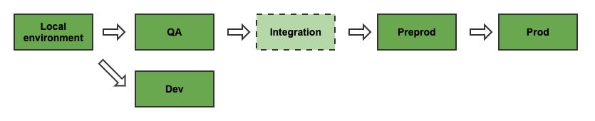

# Dataworks AWS Phase 1 Test Strategy

This page details the overall test strategy used for the AWS Phase 1 workstream by the Dataworks team. This is a living document and will evolve over time.

## Testing mantra

Our mantra for the team which sums up the way we think about quality is:

`Quality is everyone's responsibility`

## Guiding principles

Our test strategy is influenced by the following principles we adhere to as a team:

* Test as early as possible
* Treat test automation code as production code
* All test automation must run as part of the CI pipeline
* All new and altered features will be covered by test automation
* Test automation is stored as close to the production code as possible
* All our components must be testable and have testability designed and built in
* The role of a tester
* The AWS Phase 1 work stream does not have a traditional tester within the team. Instead there are multiple experienced engineers with a proven background and focus on testing and quality. These people act as advocates of quality for the team and consult and guide the rest of the team in quality.

## Areas of focus

The following are the main areas a traditional tester would be able to add value. We mitigate this potential risk with our ways of working and our definition of done.

### Seeing the big picture	

#### Mitigations - ways of working
* Pairing/mobbing
* Fortnightly team updates
* Project & product milestones
* Team ceremonies

#### Mitigations - definition of done
* Product owner agreement before implementation starts
* Business value must be defined before 3 Amigos starts
* Story must be updated and commented through lifecycle

### Testing early and testing often	

#### Mitigations - ways of working
* Continuous integration and testing
* Small, equal sized user stories
* Test automation pyramid

#### Mitigations - definition of done
* Individual component automation must be present
* Feature verification tests must be performed locally
* Pull requests must be raised and reviewed

### Testing the right thing	

#### Mitigations - ways of working
* Pairing/mobbing
* 3 amigos sessions
* Peer reviews

#### Mitigations - definition of done
* Acceptance criteria must be detailed before implementation starts
* Peer reviews must be undertaken on all work

## Path to live

DataWorks have a continuous deployment system in place for the Phase 1 components. This together with our local development environments form our path to live. Quality activities take place at every stage, following the principles laid out above to provide the quickest feedback on changes which we make.

### Continuous deployment path:

We have a pipeline that includes deploying to both a QA and a Dev environment at the same time but only the QA environment is part of the actual path to live. The Dev environment is used as a sandpit and enables the team to deploy and test new features from their local machines. This enables quick feedback for team members and allows the team to deploy to dev and test on a full environment without blocking the path to live.

Note that the integration environment is part of the path to live, but as the data produced by UC is not suitable on this environment, it is currently not used for Quality assurance activities.

### Quality activities:

#### Local (branch)	

*TEST AUTOMATION*
* Unit tests
* Integration tests
* Local docker ecosystem

*TESTING*
* Local feature sanity check

*DATA*
* Synthetic
* Invalid and valid data scenarios
* All acceptance criteria covered

#### Local (master)	

*TEST AUTOMATION*
* Unit tests
* Integration tests
* Local docker ecosystem

*TESTING*
* Integrated local feature sanity check	

*DATA*
* Synthetic
* Invalid and valid data scenarios
* All acceptance criteria covered

#### Dev/QA	

*TEST AUTOMATION*
* Feature tests
* End to end scenarios

*TESTING*
* Sanity test new functionality
* Manually deploy and test branches on dev

*DATA*
* Synthetic
* Representative structure and values of live
* All acceptance criteria covered

#### Preprod

*TEST AUTOMATION*
* Manifest production for data reconciliation	

*TESTING*
* Perform tests on the product monitoring

*DATA*
* Non-PII
* Representative structure, values and volumes of live
* All acceptance criteria covered

#### Prod

*TEST AUTOMATION*
* Manifest production for data reconciliation

*TESTING*
* Perform tests on triggering monitoring alerts	

*DATA*
* Real
* Sanitised data for data reconciliation manifests

## Definition of Done

The full definition of done can be found here and is heavily entwined with the test strategy (as shown above): https://wiki.ucd.gpn.gov.uk/display/UCDIP/Definition+of+Done

