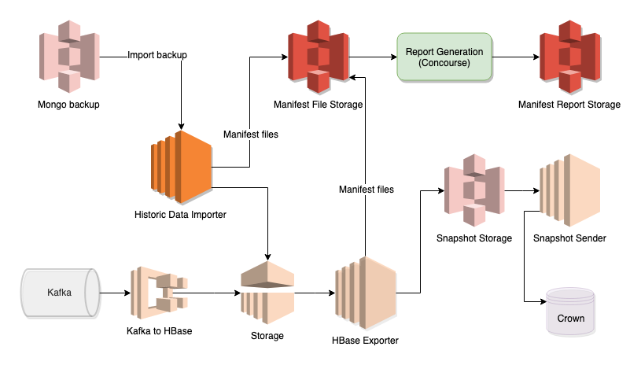

## Overview

This document details the data reconciliation process between the data received from UC and the data exported to Crown in the snapshots.

## Purpose

This process helps to increase confidence in the quality of the data that the new ingestion process sends to Crown. It will highlight any data differences between the Mongo backup and the Kafka streamed data.

## How the manifest is produced

The faded components are part of the ingestion process and the other components are the ones involved in the manifest production.

The Historic Data Importer is used to import the Day 0 backup when ingestion goes live. We have enabled a "manifest mode" for the data reconciliation too, so the steps below are how the reconciliation works:

1. HBase Exporter runs every night as per ingestion process and at the same time produces small files for every record it successfully writes to a snaphot file and stores these in Manifest File Storage.
2. Mongo backup receieved from UC on request.
3. Historic Data Importer is kicked off in manifest mode, which produces small files for every single record and stores in Manifest File Storage (manifest mode does NOT import data to ingestion).
4. Report generation kicked off via Concourse CI pipeline - this runs SQL queries via Amazon Athena to generate the report and store it in S3.

## What will it show?

The report in to the data quality will show nine pieces of information, the first four of which are:

1. Databases which are in the Mongo database backup but are not represented in the streamed Kafka data
2. Databases which are represented in the streamed Kafka data but not in the Mongo database backup
3. Collections which are in the Mongo database backup but are not represented in the streamed Kafka data
4. Collections which are represented in the streamed Kafka data but not in the Mongo database backup

The remaining pieces of information are below and will be grouped by collection:

5. IDs which are in the Mongo database backup but are not represented in the streamed Kafka data
6. IDs which are represented in the streamed Kafka data but not in the Mongo database backup
7. IDs which have a later timestamp in the Mongo database backup than they do in the streamed Kafka data
8. IDs which have a later timestamp in the streamed Kafka data than they do in the Mongo database backup
9. Percentages (compared to all IDs) and counts of IDs which are in categories 5-8

For the above categories, the following information will be shown for each ID in them:

* Full ID
* Timestamp in Mongo backup (if ID present here)
* Timestamp in Kafka stream (if ID present here)
* Collection
* Database

## How do we validate the report?

There is a step that validates the results of the queries used in the report. In production we can't do this as we don't know the data used. However in dev and qa, the pipeline uploads fixture data for the manifest report to use (held in this repo). This data is simulated manifests that would come out of HDI and HTME.

The CI pipelines pass in the location of the import and export manifest sets for the report to use. For production, they pass the location HDI and HTME create them in for real. In dev and QA, they pass in the location of the fixture data.

As this is static data, we know what should be output by the queries. Therefore, each production or import query (see below for query type explanations) has a corresponding CSV file in this repo which is the expected output on dev and QA.

## Report generation - how to generate a report

There are three parts to the manifest report generation, the HBase Exporter files, the Historic Data Importer files and the report itself.

### Generate an "import" manifest set

The Historic Data Importer needs executing in "manifest mode" to produce the manifest files. To do this, there is a Concourse job which any team member can execute. To do this, you need to:

1. Ensure that the terraform local value for "uc-snapshot-list" in aws-internal-compute is set to the location for the UC backup
2. If it is not, a Pull Request is needed to change it
3. Wait for that change to reach the environment you wish to generate the manifest files in
4. Kick off the relevant environment's job in the uc-snapshot-list group in aws-internal-compute concourse pipeline
5. When complete, check Concourse output to ensure there are files listed as present
6. Kick off the relevant environment's job in the uc-data-load group in aws-internal-compute concourse pipeline
7. This sends an SQS message to the importer to tell it to do its work
8. You will need to wait for the importer to finish and can monitor this with the Cloudwatch logs (will need SC clearance for Preprod and Prod environments)

*Every time you run HDI in manifest mode in production it generates new import manifest files and deletes the existing ones so only do this as part of a ticketed piece of work*

### Generate an "export" manifest set

HTME generates an export manifest set every time it runs. To do this, you would need to run the relevant job in the `generate-snapshots` pipeline. To use all collections, pass in the following environment variable from the pipeline -> `GENERATE_SNAPSHOTS_TOPICS_OVERRIDE` with the value set to `ALL`.

*Every time you run HTME in production it generates new export manifest files and deletes the existing ones so only do this as part of a ticketed piece of work*

### Report generation

To generate a report, you simply need to kick off the relevant environment job in the manifest-comparison group in the aws-ingestion pipeline.

This will output the results to the output S3 prefix listed in terraform locals in aws-ingestion as `manifest_comparison_query_output`.

It will also output to the Concourse job log.

Report generation is safe to do at any time, but the job must be allowed to finish to avoid half populated tables on Athena.

## Report generation - technical details

The manifest set generation is explained above and for technical details on HDI or HTME have a lot at their individual repos.

This repo contains the code to generate the manifest report itself and so will explain the technical details here. Manifest generation is done via the behave feature `manifest-generation` and the code can be found there. There are a number of steps that are performed when a manifest is generated. You should be able to view the features and steps in the behave code and follow what they do against the steps below.

### Create Athena tables

The first step is to generate Athena tables for the manifest sets. There are sql template files for creating these tables that CI passes in the location of the manifest sets from the terraform outputs. Two tables are created - one for import and one for export. They act as layers over the top of the S3 locations - when a query is executed in Athena, it actually runs directly against the S3 files using the table as a structure pointer for the files. We use CSV format for the manifests and this correlates to columns in the Athena tables.

### Execute Glue job

AWS Glue is used to generate a combined table from the import and export Athena tables. To do this, there is a job (stored and deployed from `aws-ingestion` repo) which gets the data from the Athena tables and performs `pyspark` jobs on the data to generate a full table of all records. Matching ids from both tables go on the same row and calculations like which manifest set has the earliest timestamp, the types of records and other things are worked out in the glue job and added to the table. The results are saved are perquet files (a format similar to json but more performant for big data queries). The glue job produces another Athena table for the combined data and this acts like the others. The difference is that this table sits over the parquet files in S3. If they were json format all the sql queries we run would time out.

### Generate the queries

In this repo, there are lots of SQL queries which we use to run against the combined table and produce the reports. See the top of this document for the explanations of each query output. Technically, these are Presto SQL queries as Athena runs Presto SQL under the hood. This is slightly different to Oracle syntax, MS SQL syntax or other SQL flavours but has documentation on the internet to help.

The queries are split in to different types and can be found in folders with the same name as the type.

#### Production queries

These are the queries that make up the main report and are always run.

#### Import queries

These are queries which tell us information about the import data only. We are not as concerned about the results of these as they are not something to be concerned about with missing data and more for information only. These don't run with the main production manifest, but can be run on their own.

#### Specific queries

These are queries purely for information only and they help with debugging. They can only be run by themselves.

### Report validation

In dev and qa, an extra step runs which checks the output against the expected output in the CSV files. See above for full explanation on the data used in each environment. As the e2e framework is environment agnostic, the CI pipeline passes in whether to run the validation or not.

## CI structure

The `manifest-comparison` pipeline on Concourse has been designed to make it easy to generate the report that you need as quickly as possible.

### Full manifest run

In order to generate the full manifest comparison report, you can use the job for the relevant environment under the group `manifest-comparison-full`. This will clear out the existing combined table, re-generate it from the import and export manifest sets and run the production and import queries (in different tasks).

In dev and qa it will also verify the query outputs.

### Individual query execution

Under the group `manifest-comparison-queries-only` there are jobs for production to run only the queries. Each type of query (see above) has a job to run those queries.

*This does not clear out and re-populate the combined table*.

This means the jobs as fast as populating the tables is 90% of the run time for the pipelines. But it means the queries will use the populated data from the last "full" run against that environment. Bearing this in mind is important when looking at the results.

If new manifest sets from import or export need to be taken in to account with the report results, you must run the "full" job instead.

## Local execution

The manifest comparisons can be run locally against dev and there are multiple scripts to help with this in the `src/runners/manifest-comparison` folder.

### Running the full process

To run the full dev process including population use the `run-dev-manifest-comparison-full.sh` script. This will populate and run all the queries and perform result validation.

### Queries only

To run all the queries including population use the `run-dev-manifest-comparison-all-queries.sh` script. There are also scripts for running queries of one type only.

The queries only ones do not populate the data again.

### Data population

There is a script also for re-populating the data on dev, but running no queries named `run-dev-manifest-comparison-populate.sh`.
