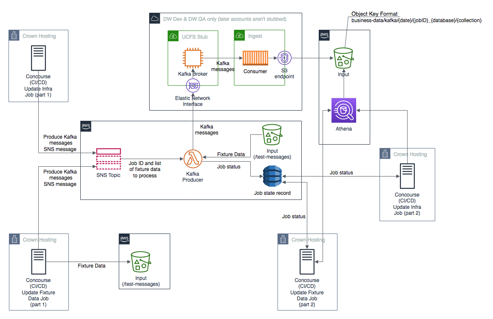

# Testing BAU Event Ingestion



1. One or more test input data files will be committed to Git. The
   format of the test data is provided [below](#fixture-test-data-format).
   Whilst the filename doesn't affect how messages will be processed, it's
   suggested they're named to clearly show their purpose
1. On detecting a change to the input test data, Concourse will upload the file
   to the `fixture-data/business-data/kafka` prefix of the `Input` S3 bucket. 
   Note that in order to support stream processing of the fixture data, the 
   upload process will convert the data first, so that each JSON message 
   will be contained on a single line of the S3 object.
1. When a test run is started, it will first request the fixture data to be
   converted from S3 to Kafka messages by publishing a
   `fixture data conversion request` message onto an SNS topic. The format of
   the SNS message is provided [below](#fixture-data-conversion-request-format).
   Once the request has been made, the CI job will insert a row into a DynamoDB
   table showing that the request status is `QUEUED`.
1. A Lambda Function will be subscribed to the SNS topic.  On receipt of the SNS
   notification, it will update the DynamoDB table to show that the request is
   now `RUNNING`. The Lambda Function will then read the data requested in the
   SNS notification from the `fixture-data/business-data/kafka` prefix of the
   `Input` S3 bucket and publish them as Kafka messages to the
   UCFS Stub Kafka brokers; each line of the input object will be converted into
   a message published to a Kafka topic named `business-data-tests`.
   In order for the consumers to know which CI job requested the data, the
   `{job_id}` will be injected into the `{db}` field of the Kafka message prior
   to it being published. e.g. `"db": "core"` in the fixture data would become
   `"db": "genTestData_194_core"`. If the Lambda is able to publish all of the
   requested data to the Kafka topics, then it will update the DynamoDB table
   with a `SUCCESS` status, otherwise it will update it with a `FAILURE` status.
   This will allow the test jobs to determine when it is safe for them to start
   invoking the tests.
1. The Kafka consumers will read the messages from the `business-data-tests`
   Kafka topic and write them to object(s) with a name of
   `{collection}_{seq_num}.json` under a prefix of
   `business-data/kafka/{date}/{db}/{collection}/` of the `Input` S3 bucket.
   `{db}` and `{collection}` will be obtained from the Kafka message.
1. Test assertions will be written using s3 queries over the `business-data/kafka/{date}/{db}/` prefix of the
   `Input` S3 bucket. To allow for the time that messages may take to transition
   through the infrastructure, the Concourse pipeline will wait for a period of
   time before running these queries and this step will be retried a number of
   times. Both the wait time and number of retries will be adjusted to suit
   message processing times.
1. If the test assertions pass, Concourse will mark the test run as having
   succeeded
1. If the timeout period is reached, without the test assertions having passed,
   Concourse will mark the test run as having failed
1. The end to end ingestion tests will be part of the Dev and QA deployments for
   the aws-ingestion and ucfs-stub infrastructure, as well as the pipeline that
   uploads changes to the input test data (see step 2)

## Fixture Test Data Format

Each fixture data file will contain a single array.  The array will contain
one or more JSON objects with the following structure:

```
[
    {
        "traceId":"00001111-abcd-4567-1234-1234567890ab",
        "unitOfWorkId":"00002222-abcd-4567-1234-1234567890ab",
        "@type":"V4",
        "version":"core-X.release_XXX.XX",
        "timestamp":"2018-12-14T15:01:02.000+0000",
        "message":{
            "@type":"MONGO_UPDATE",
            "collection":"exampleCollectionName",
            "db":"exampleDbName",
            "_id":{"exampleId":"aaaa1111-abcd-4567-1234-1234567890ab"},
            "_lastModifiedDateTime":"2018-12-14T15:01:02.000+0000",
            "encryption":{
                "encryptionKeyId":"55556666-abcd-89ab-1234-1234567890ab",
                "encryptedEncryptionKey":"bHJjhg2Jb0uyidkl867gtFkjl4fgh9Ab",
                "initialisationVector":"kjGyvY67jhJHVdo2",
                "keyEncryptionKeyId":"example-key_2019-12-14_01"
            },
            "dbObject":"bubHJjhg2Jb0uyidkl867gtFkjl4fgh9AbubHJjhg2Jb0uyidkl867gtFkjl4fgh9AbubHJjhg2Jb0uyidkl867gtFkjl4fgh9A"
        }
    }
]
```

For readability and ease of editing the fixture data, each JSON object should
be split over several lines (as above), rather than trying to have each test
fixture on its own line.

## Fixture Data Conversion Request Format

The JSON structure sent as a payload to SNS, to signal the conversion of
S3 objects to Kakfa messages, should be in the following structure:

```
{
    "job_id": "aws-ingest_upload-fixture-data-dev_15",
    "bucket": "bucket_id_here",
    "fixture_data": ["fixture-data/business-data/kafka/functional-tests/",
                     "fixture-data/business-data/kafka/regression-tests/"]
}
```

* `job_id`: should identify the CI job, including build number, that requested
  the conversion.
* `bucket`: the S3 bucket that contains the fixture data
* `fixture_data`: an array of S3 prefixes that contain the fixture data to be
  converted

## Test execution locally

You can use the runner shell scripts to execute the tests locally if needed.

Simply run the relevant script for the right environment in tests/bau/runners and pass in a build number. The build number needs to be unique to your username on that particular date.

I.e.

```
./tests/bau/runners/run-dev.sh "1"
```
